# Item-Catalog
Udacity Full Stack Nanodegree Project 4

## About:

In this Item Catalog project, you will build a RESTful web application that displays all the avenger movie catalog along with the movie character list and the homepage implements a third-party authentication & authorization service (in our case Facebook accounts). Only Authorized user can perform Create, Read, Update, and Delete operations, whereas unauthorized user can read the contents.

## Setting up the Environment
1. Download and Install python3 ver 3.6.7 (https://www.python.org/downloads/)
2. Install Vagrant Tools to turn on Virtual Machine ( https://www.vagrantup.com/downloads.html )
3. Install VirtualBox Version 5.1.38 r122592 (https://www.virtualbox.org/wiki/Downloads)
4. Download the VM configuration called FSND-Virtual-Machine for this project 
  ( https://github.com/udacity/fullstack-nanodegree-vm ) 
5. Put it into vagrant directory which is shared with your virtual machine

## Steps to run the python codes:

1. clone the repository into vagrant directory from the following source. (https://github.com/DeepLearnerSC/item-catalog)

2. Command `$ vagrant up`, ans then type `$ vagrant ssh` to start the VM

3. 'cd' to 'item-catalog' and you will find 'project.py' and 'database_setup.py'

4. Command `$ python database_setup.py` to to create `itemcatalog.db' or you could skip to step 5.

5. Command `$ python lotsofmenus.py` to initalize the predefined data (optional) 

5. Command `$ python project.py`, then you are ready to test the 'item-catalog'

6. Open up your browser and go to http://0.0.0.0:5000.

7. Done

## JSON Endpoints

`/api/v1/catalog.json` - Returns JSON of all items in Avenger catalog

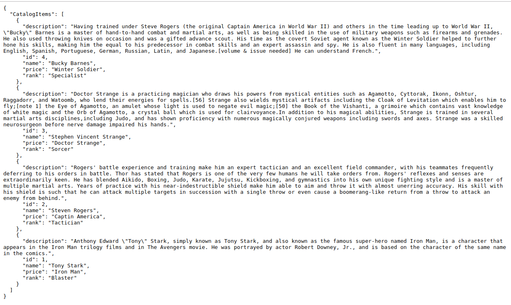

`/api/v1/categories/<int:category_id>/item/<int:catalog_item_id>/JSON` - Returns JSON of selected item in Avenger catalog

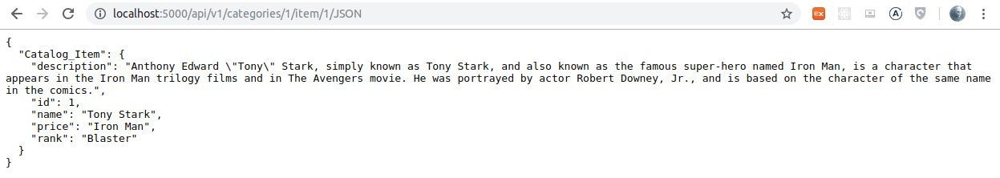

`/api/v1/categories/JSON` - Returns JSON of all categories in catalog

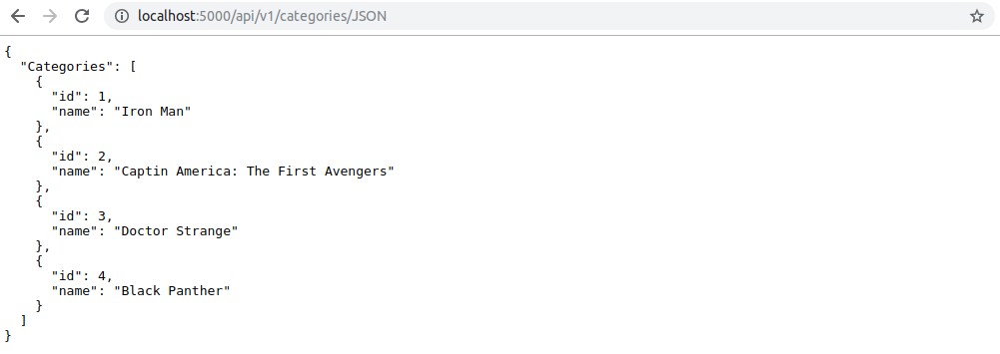

# REST Endpoints

#### Login

`/login` - Login page

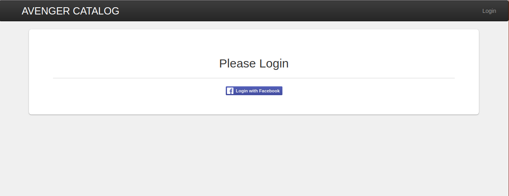

#### CRUD: Read

`/` or `/categories` - Catalog page with all categories and recently added items

Shows you all the items available for that category.

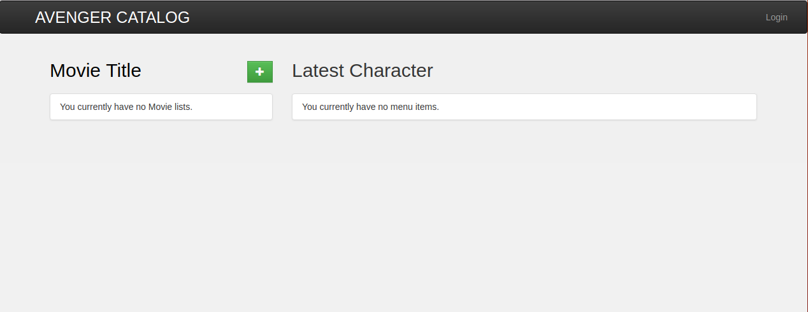

Main page after you succesfully logged-in.

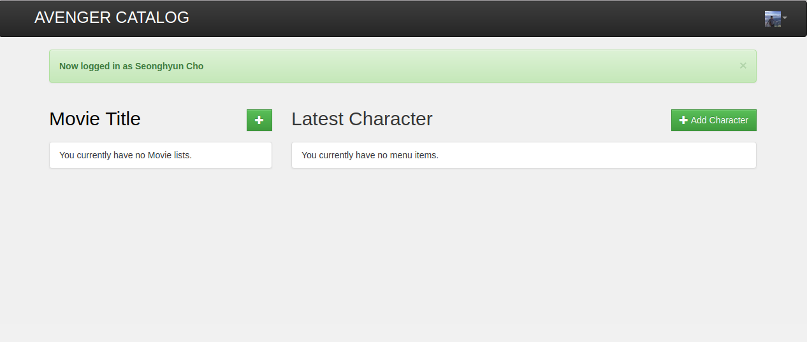

Selecting a specific category shows you all the items available for that category.

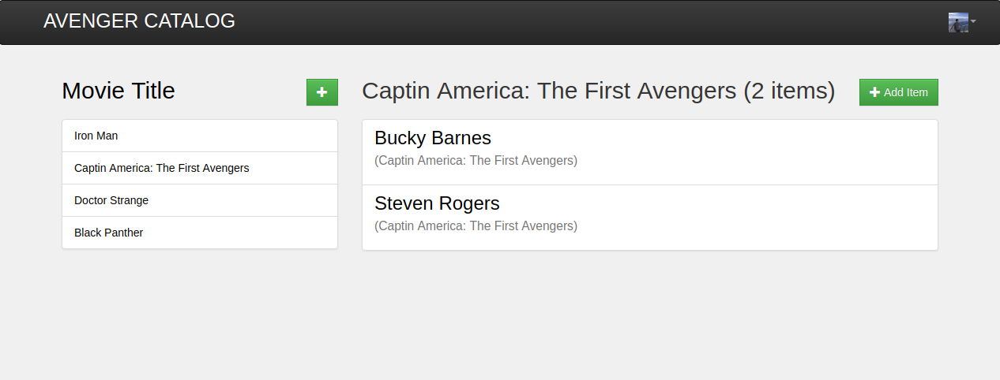

Selecting a specific item shows you specific information about that item.

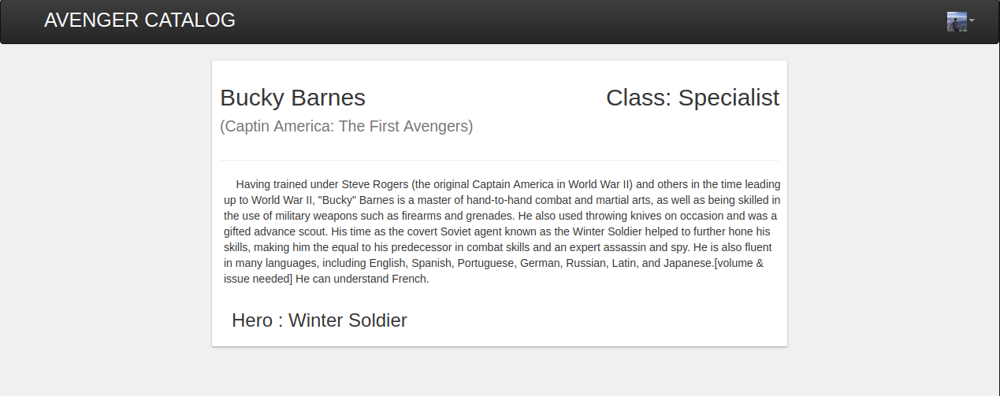

#### CRUD: Create

`/categories/<int:category_id>/` or `/categories/<int:category_id>/items/` -  items in category

`/categories/new` - Allows user to create new category

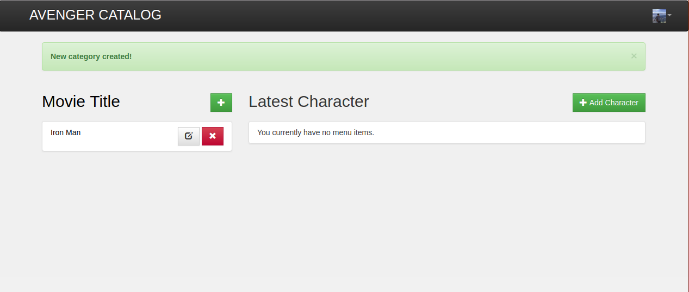

Enter the Movie title and then click update

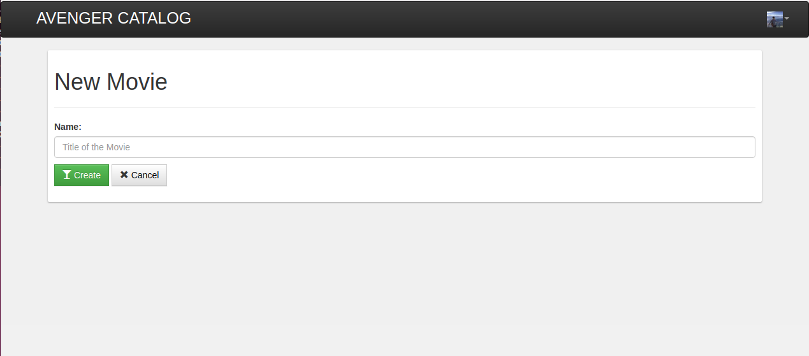

Now new movie title has been added

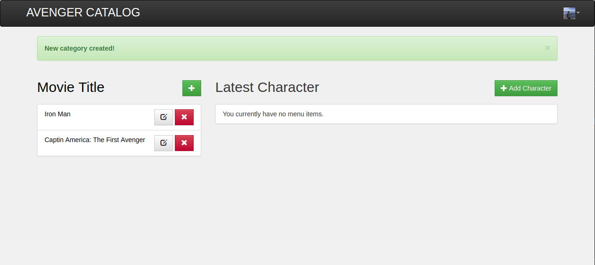

`/categories/item/new` - This page will be for making a new catalog item

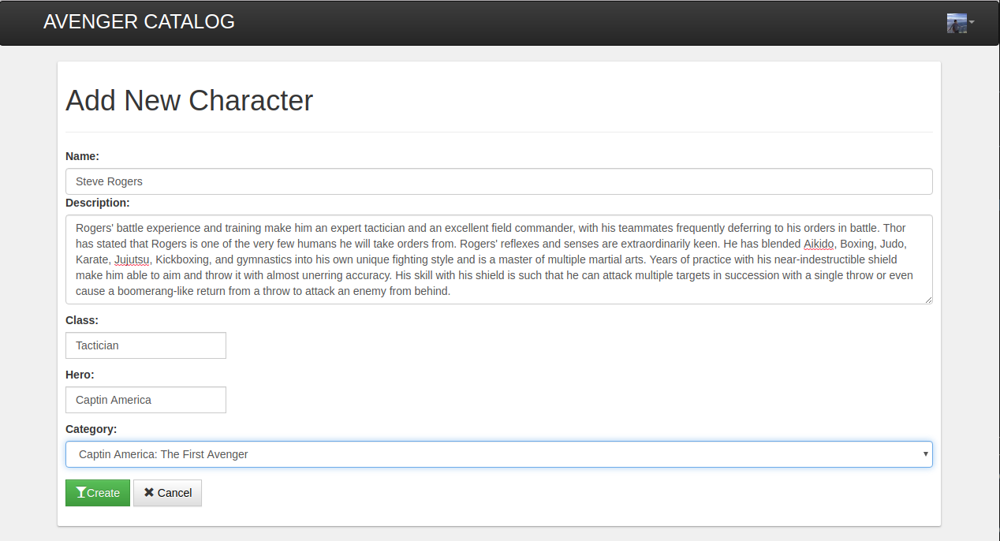

Now new character has been added

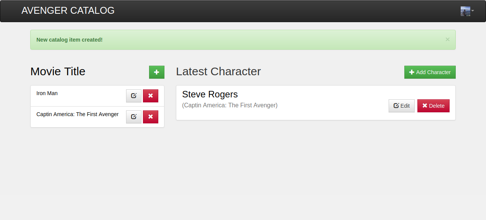

#### CRUD: Update

Item can be updated by pressing the update button

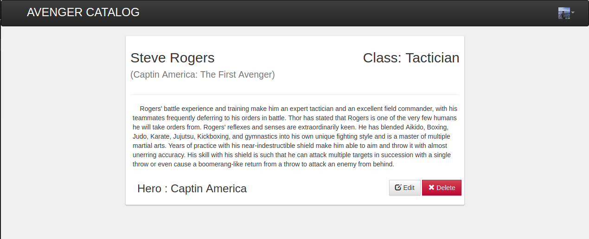

`/categories/<int:category_id>/item/<int:catalog_item_id>/edit` -  This page will be for making a updating catalog item

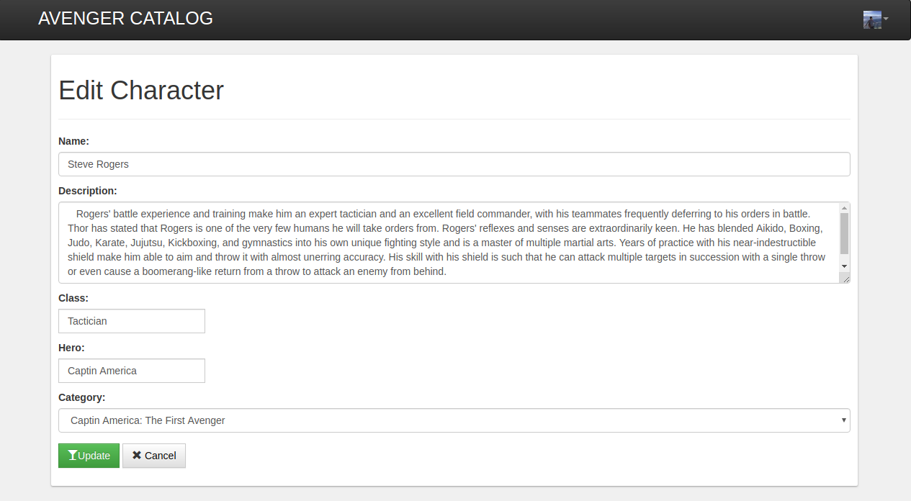

Catalog item has been updated

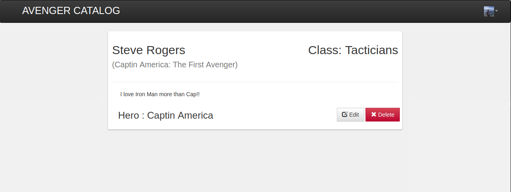

#### CRUD: Delete

`/categories/<int:category_id>/item/<int:catalog_item_id>/delete` - This page will be for deleting a catalog item

If you press 'delete', then selected item will be removed for the data storage

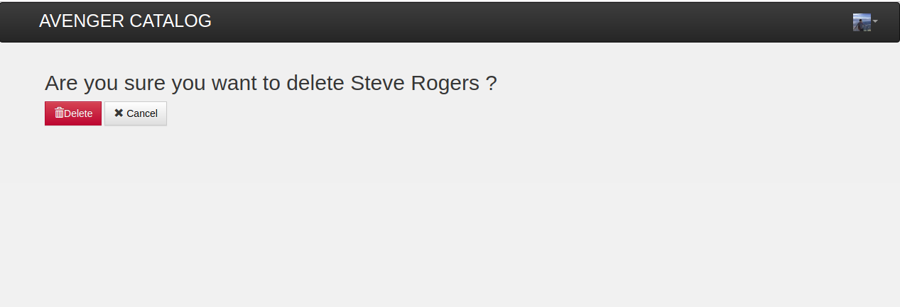

Item has been removed

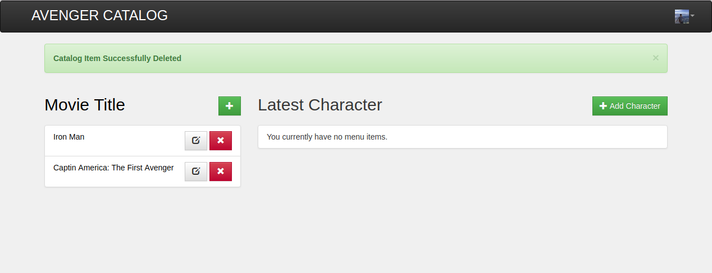
